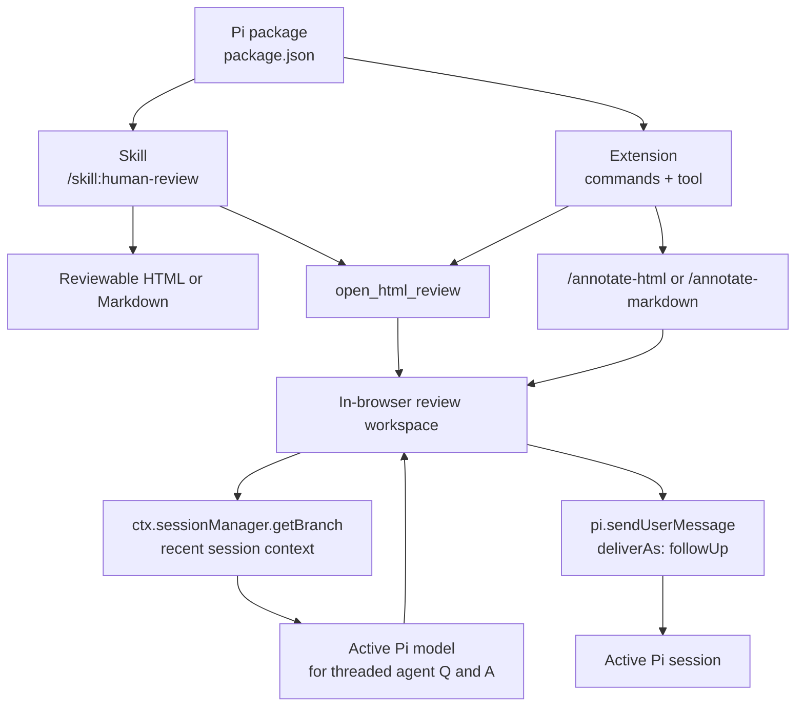

# pi-human-inquire

pi-human-inquire turns plans, notes, specs, RFCs, recaps, research, diffs, and other structured content into reviewable documents where humans can ask agent questions and leave feedback directly inside the document.

It includes:

- direct Markdown review support for fast rendering without model-generated HTML
- the Reviewable Document skill (`human-review`), which opens Markdown directly when possible or creates a standalone review page when needed
- an in-browser review workspace for comments, contextual questions, threaded discussion, and submitting feedback back to Pi

## Install

Pi packages can be installed from npm, git, or a local path.

### Try without installing

```bash
pi -e npm:pi-human-inquire
```

### Install globally

From npm:

```bash
pi install npm:pi-human-inquire
```

From git:

```bash
pi install git:github.com/alpeshvas/pi-human-inquire
```

From a local checkout:

```bash
pi install .
```

### Install for a project

From npm:

```bash
pi install -l npm:pi-human-inquire
```

From git:

```bash
pi install -l git:github.com/alpeshvas/pi-human-inquire
```

From a local checkout:

```bash
pi install -l .
```

## Run from source

Pi loads TypeScript extensions directly, so there is no build step. To inspect and run the package from source:

```bash
git clone https://github.com/alpeshvas/pi-human-inquire.git
cd pi-human-inquire
pi -e .
```

To install the local checkout globally:

```bash
pi install .
```

Or for just the current project:

```bash
pi install -l .
```

You can also preview the npm package contents before publishing or installing:

```bash
npm pack --dry-run
```

## Usage

### Generate or open a reviewable document

Use the skill:

```text
/skill:human-review
```

You can invoke it with no arguments, with a file path, or with an instruction:

```text
/skill:human-review notes.md
/skill:human-review turn this RFC into review HTML
/skill:human-review make the previous plan reviewable
```

The skill uses the provided content, or the most recent structured content in the conversation. Markdown paths are opened directly through the fast built-in renderer; other inline content can still be written as a review artifact and opened in the browser. If it cannot find suitable content, it asks you for a path or content.

### Open existing Markdown or HTML

If you already have a Markdown or HTML file:

```text
/annotate-html /absolute/path/to/document.md
/annotate-markdown /absolute/path/to/document.md
/annotate-html /absolute/path/to/document.html
```

Legacy alias:

```text
/annotate-plan-html /absolute/path/to/document.html
```

## In-browser review workspace

In the opened review workspace, you can:

- select text for comments
- continue threaded agent Q&A in place
- add document-level notes
- edit or remove comments
- submit feedback back into the active Pi session

Agent answers use the document, current block, selected text, existing comments, thread history, and recent session context.

## Architecture



## Skill options

Use direct Markdown paths for fastest rendering:

```text
/skill:human-review notes.md
/annotate-markdown notes.md
```

Use lite mode for quick/minimal HTML output when HTML generation is still needed:

```text
/skill:human-review --lite notes.md
```

Use stubs when iterating on a plan or spec and you want sections to remain stable across revisions:

```text
/skill:human-review --with-stubs spec.md
```

By default, generated HTML artifacts are written to:

```text
~/.agent/diagrams/<slug>.html
```

## Feedback submission

Submitted feedback is saved locally and sent back into the active Pi session.

## Compatibility notes

For now, `/annotate-plan-html` remains an alias for `/annotate-html`; `/annotate-html` also accepts Markdown.
